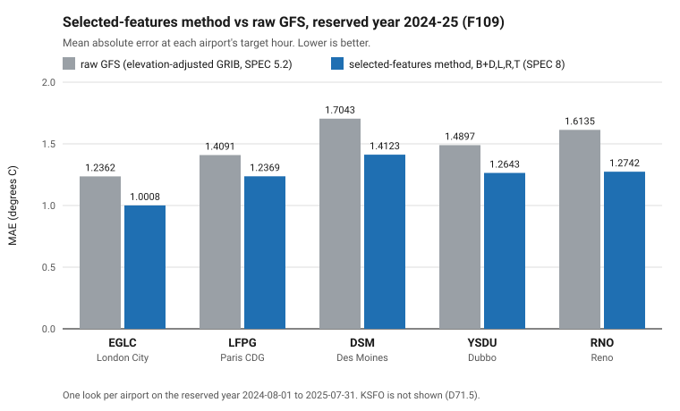
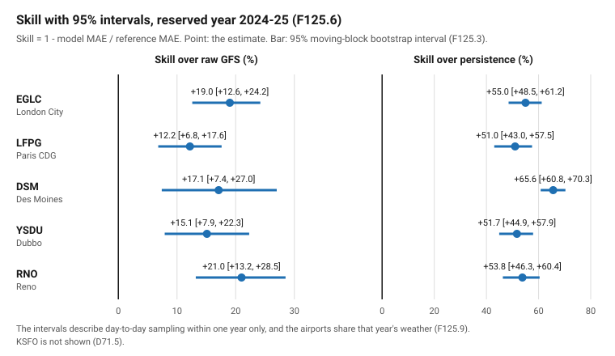
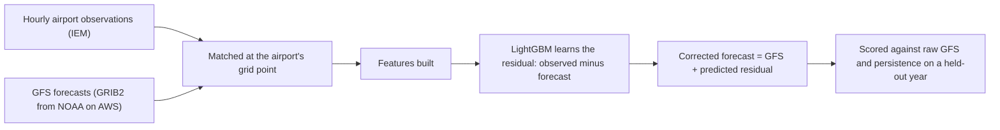

# MLwx

Machine-learning correction of GFS temperature forecasts at airports.

## 1. In 30 seconds

GFS is the US National Weather Service's global weather model. At any one
airport it tends to make the same small temperature error again and again.
MLwx learns that repeated error from past forecasts and past observations,
and corrects new forecasts with it. At five airports, on a reserved year,
the selected-features method lowers the mean absolute error (MAE, the
average size of the miss) against raw GFS by 12.2% to 21.0%, and every 95%
interval lies above zero (F109, F125.6). Each claim came from a single
look at held-out data, with the pass rule fixed in writing first. The
work now under way is stage C: an hourly corrected temperature curve for
every GFS run (D82).

This is a research project and a private tool. It is not an operational
forecast, and it must not be used for safety-critical decisions.

Numbers such as F109 or D82 point to entries in the project's decision
log, [DECISIONS.md](DECISIONS.md), or its archive,
[DECISIONS-archive.md](DECISIONS-archive.md). "SPEC 8" means section 8 of
[SPEC.md](SPEC.md).

## 2. Headline result



*The selected-features method has a lower MAE than raw GFS at all five
airports on the reserved year 2024-08-01 to 2025-07-31 (F109).*

The method is `B+D,L,R,T` (SPEC 8). Each airport was judged once on the
reserved year 2024-08-01 to 2025-07-31 (F109). MAE is in degrees Celsius.
Skill is `1 - model MAE / reference MAE`, so a positive skill means the
model beats the reference. Persistence is the lazy guess that tomorrow's
temperature equals today's. The brackets are 95% intervals from a
moving-block bootstrap (7-day blocks, 10,000 resamples; D75.2, F125.6).

| airport | raw GFS MAE (F109) | model MAE (F109) | skill over raw GFS [95%] (F125.6) | skill over persistence [95%] (F125.6) |
|---|---|---|---|---|
| EGLC (London City) | 1.2362 | 1.0008 | +19.0% [+12.6, +24.2] | +55.0% [+48.5, +61.2] |
| LFPG (Paris CDG) | 1.4091 | 1.2369 | +12.2% [+6.8, +17.6] | +51.0% [+43.0, +57.5] |
| DSM (Des Moines) | 1.7043 | 1.4123 | +17.1% [+7.4, +27.0] | +65.6% [+60.8, +70.3] |
| YSDU (Dubbo) | 1.4897 | 1.2643 | +15.1% [+7.9, +22.3] | +51.7% [+44.9, +57.9] |
| RNO (Reno) | 1.6135 | 1.2742 | +21.0% [+13.2, +28.5] | +53.8% [+46.3, +60.4] |

**Every interval lies above zero, against both references, at all five
airports.** "Raw GFS" here is the GFS 2 m temperature after this project's
fixed elevation adjustment (SPEC 5.2, D48.10). Persistence is scored only
on test days that have a previous-day observation, so its day count can be
a few days smaller than raw GFS's (F125.6, F125.8).

Four things must be read with that table:

- **The minimal method fails at Reno** (-3.1% against raw GFS, F82). Its
  margins over raw GFS at DSM, YSDU and RNO have 95% intervals that
  include zero: DSM +6.3% [-4.2, +14.8], YSDU +3.3% [-4.9, +11.1], RNO
  -3.1% [-13.4, +8.1] (F125.4).
- **KSFO (San Francisco) passes both of its pre-registered looks** (F119,
  D71). Its headline is look A: 1.2576 against 1.4263, +11.83% over raw
  GFS (D71.2). It is **not directly comparable** with the five airports
  above: its grid point is partly over the sea, and its check against
  Open-Meteo failed, explained by a difference between the sources (D69,
  D71.5; RESULTS 6.5).
- **The intervals describe one test year only.** They capture day-to-day
  sampling within that year, not year-to-year variation. The airports
  share each year's weather, so the five intervals are not independent
  (F125.9). The intervals are descriptive and change no verdict (D75.2).
- **Both held-out years are now spent** at every airport (D59.5, D71.1).
  The 2026-27 forward test is pre-registered and its models are frozen
  (D73, F122). It has not been scored (D73.8).



*The same five airports' skill with its 95% interval, over raw GFS (left)
and over persistence (right). The vertical black line is zero (F125.6).*

Full tables, caveats and the other two methods' intervals are in
[RESULTS.md](RESULTS.md) (section 6.6 for the intervals).

## 3. What this project demonstrates

- **Pre-registered, one-look evaluation.** The pass bar is fixed in
  writing before a held-out year is opened, and each method looks at each
  held-out year only once (SPEC 2.4, 5.0). The richer and selected methods were each
  judged this way (F94, F109).
- **A failure, reported honestly.** The minimal method failed at Reno
  (F82). A richer method was then built, locked and given its own single
  look, and it passed (F94). Both results stand (D48.13).
- **Benchmarked against operational products.** On the spent years the
  selected method was compared with NWS MOS and the National Blend of
  Models (NBM). Against NBM the outcome was MIXED: the model's MAE was
  lower at 1 of 4 airport-looks (F127). The direction decision followed
  (D78.1).
- **Data engineering.** Stage C's pull read GFS GRIB2 files by byte range
  on GitHub Actions: 65 months, 195,600 files, 1,932,528 messages,
  published as Release files. A 13-check verifier ran on each month
  before it was published, except the first month (2022-01), which ran
  before the verifier existed and was checked afterwards. All 65 months
  were then downloaded and checked again (D84.4, F134, D87, F137).
- **Leakage control.** Data is split by time only, never at random, and
  guards in code refuse rows from held-out or future years (SPEC 2.1,
  D89.3, F139.5).
- **Reproducibility.** Packages are pinned, raw pulls are committed with
  their pull date and exact query, inputs are checked by SHA-256 (a
  file fingerprint), and repeat runs give byte-for-byte equal output
  (SPEC 2.3, F138, F139.5).
- **The same recipe at every airport.** Nothing is tuned per airport
  (SPEC 2.5).

## 4. How it works



LightGBM is a gradient-boosted tree model, a standard tool for
table-shaped data. The approach is a form of Model Output Statistics
(MOS), the decades-old technique of learning a weather model's local error
from past forecasts and observations.

**Target.** The temperature at one fixed hour a day, chosen for each
airport so that it falls at local solar noon (SPEC 4.1). Daylight saving
is ignored, so the hour stays fixed all year. The model learns the
residual: observed temperature minus the GFS forecast (SPEC 4.2). The
corrected forecast is GFS plus that predicted residual.

**Three methods**, each tested against the same frozen pass bar (SPEC
5.3): the corrected forecast must beat both raw GFS and persistence on MAE
over the held-out period.

1. **Minimal method** (SPEC 1 to 6). Three features: the GFS forecast
   temperature and two season terms. Forecast source: Open-Meteo's
   Previous Runs API. Passes at EGLC, LFPG, DSM and YSDU and fails at RNO
   (F16, F30, F47, F64, F82).
2. **Richer 5-feature method** (SPEC 7). Adds cloud cover and 10 m wind
   speed, and reads GFS 0.25 degree GRIB2 files (the standard binary
   format for gridded weather data) straight from NOAA's public archive on
   AWS. Passes at all five airports, Reno included (F94).
3. **Selected-features method** (SPEC 8). The richer method plus four
   features chosen by a staged, time-ordered search: moisture, lapse rate
   (how fast temperature falls with height), shortwave radiation and
   pressure tendency. Passes at all five airports on the reserved year
   (F109). It is the project's default recipe (SPEC 8.7). It also passes
   at KSFO on two looks (F119).

**Discipline.**
- Splits are by time only, and every model is trained only on data from
  before its own held-out period (SPEC 2.1a). The windows as recorded:
  - Minimal and richer methods: train 2021-03-24 to 2025-07-31, test the
    sealed year 2025-08-01 to 2026-07-31 (SPEC 4.3, 7.2).
  - Selected method: train 2021-03-24 to 2024-07-31, test the reserved
    year 2024-08-01 to 2025-07-31 (SPEC 8.3, D51).
  - KSFO, two looks: look A trains 2021-03-24 to 2024-07-31 and tests
    2024-25; look B trains 2021-03-24 to 2025-07-31 and tests 2025-26
    (SPEC 8.5, D70.3).
- The bar is fixed in writing before any held-out data is opened, and
  each method looks at each held-out year only once (SPEC 2.4, 5.0).
- Missing data is dropped and counted, never filled (SPEC 2.2).
- The same features and the same model settings are used at every
  airport. Nothing is tuned per airport (SPEC 2.5, D21.4).
- A result is a **claim** only if it comes from held-out data used once.
  Build choices (how the product is made) are made by cross-validation on
  other data and are never quoted as results (SPEC 2.5).

## 5. Status and roadmap

The roadmap runs as stages (SPEC 6, D72). Stages A and B run side by side.

- **A. Benchmark and source probe: done.** A probe of other weather
  models' data (F123, F124), confidence intervals (F125), the comparison
  with NWS MOS and NBM (F127, band MIXED) and the direction decision that
  followed (D78.1).
- **B. Forward test: pre-registered, not yet run.** The 2026-27 GFS
  forward test is pre-registered (D73) and its models are frozen (F122).
  Its build, fetch and scoring scripts exist and passed their gates (F128,
  F129). Each period is scored only after it has ended (D73.8).
- **C. Hourly curve on GFS: under way.** The design is set (D82, D83).
  The GRIB pull for forecast hours 0 to 24 is complete and checked
  (F137). The development table is built and gated (F138). The rules for
  build choices are fixed (D89), and the curve's baseline is fitted
  (F139). Next: D82.5's alternatives, each compared with the baseline
  under D89.6.
- **D.** Correct each other weather model on its own.
- **E.** Blend and stack the corrected models.
- **F.** An upgrade policy for when a weather model changes version,
  starting with GFS v17.
- **G.** Live product, version 1: a daily pipeline, a prediction log that
  is never edited, a simple display and one-script airport onboarding.
- **H.** Probabilistic forecasts: ranges with stated odds.
- **New airports** are an ongoing track. Stage C's claim will be judged
  on six new airports drawn by a fixed rule: EDDM, KORD, CYYZ, ZGSZ, ZUCK
  and NZWN (D82.7, F132). **Pooling** (one model across airports) is
  conditional.

## 6. Repository map

| group | entry | what it is |
|---|---|---|
| Start here | `README.md` | This file. |
| | [RESULTS.md](RESULTS.md) | The results in one place, each number cited to its entry. |
| | [figures/](figures/) | The figures in this file, drawn by `scripts/session98b_figures.py`. |
| The research record | [SPEC.md](SPEC.md) | The source of truth for how the project should work. |
| | [DECISIONS.md](DECISIONS.md) | The append-only log of decisions (D) and findings (F). |
| | [DECISIONS-archive.md](DECISIONS-archive.md) | Settled entries moved out of DECISIONS.md word for word. |
| | [STATUS.md](STATUS.md) | A snapshot of where the project is now. |
| Code and data | [scripts/](scripts/README.md) | The code, named by the session that wrote it. |
| | [tests/](tests/README.md) | Offline checks of the leakage guards, the archive tool and recorded figures. |
| | [data/](data/README.md) | Raw pulls, built tables, frozen models and rebuild checks. |
| | [requirements.txt](requirements.txt) | The pinned Python packages, with setup notes. |
| | [.github/](.github/) | The GitHub Actions workflow for stage C's GRIB pull. |
| | `.gitignore` | Files kept out of the repository. |
| How the work was run | [docs/](docs/README.md) | Session prompts, commit messages and the planning guide. |
| | [notes/](notes/README.md) | Each session's saved output, and audit reports. |
| | [CLAUDE.md](CLAUDE.md) | The standing rules for the AI coding sessions. |
| | [LICENSE](LICENSE) | The MIT licence for the code. |

The record files sit at the root, and the scripts are named by session
number, because the scripts read the record files there and the record
cites the scripts by path (D91.2).

## 7. Reproducing

This section lists what can be checked by reading `requirements.txt`, the
scripts and SPEC. The one exception is the libomp check below, which was
run in session 98b (F140).

- **Python setup.** Python 3.12.2 on macOS (arm64). From the repo root:

  ```
  python3 -m venv .venv
  .venv/bin/python -m pip install -r requirements.txt
  ```

  Versions are pinned in `requirements.txt` (for example lightgbm 4.7.0
  and numpy 2.5.2). The `eccodes` package brings the ecCodes GRIB library
  with it.
- **libomp.** LightGBM on macOS needs the OpenMP library `libomp.dylib`.
  Run `brew install libomp`. Session 98b checked this with Homebrew's
  libomp 23.1.3: with the older scripts' loader workaround switched off,
  the stage C cross-validation script reproduced F109's six recorded MAEs
  exactly, and its EGLC scores were byte-equal to the committed file
  (F140). Older scripts keep the workaround, which points at
  scikit-learn's copy of the library; it is harmless when Homebrew's
  libomp is present (see `requirements.txt`).
- **Run scripts** with `.venv/bin/python scripts/<script>.py`, not a bare
  `python`, because the system Python has no LightGBM.
- **Small raw pulls are committed** under `data/raw/`, each with a
  `.meta.txt` beside it that gives the pull date and exact query (SPEC
  2.3).
- **The bulk GRIB cache is not committed.** It is the gitignored folder
  `data/raw/grib` (about 20 GB, D47). The committed pull manifests under
  `data/raw/diagnostics/` (for example
  `session37/session37_pull_manifest.csv` and
  `session76/session76_pull_manifest.csv`) give the exact URL and byte
  range of each file. The pull scripts (`session37_grib_pull.py`,
  `session40_grib_pull.py`, and the feature pulls such as
  `session49_upper_air_pull.py`) fetch single messages from the public
  bucket `noaa-gfs-bdp-pds` by byte range.
- **Stage C's data lives outside the repo:** the Release files and the
  development table. See [data/README.md](data/README.md).
- **Not verifiable from the repo:** the full run order of all the scripts
  is spread across DECISIONS.md and is not written in one place, and no
  session has re-fetched the cache from scratch.
  [scripts/README.md](scripts/README.md) lists the scripts behind each
  headline result.
- **Frozen scripts** are never edited (D62.3(a)); the full list is in
  [scripts/README.md](scripts/README.md). Some write to fixed,
  already-committed output files, so any re-run must happen in a clean
  clone (D62.3, D62.6).

## 8. How this was built

The owner planned the work, made every decision, wrote every session
prompt and reviewed every change. The code was written by Claude Code
(Anthropic's AI coding tool) under the standing rules in
[CLAUDE.md](CLAUDE.md), one scoped session at a time. Every change was
reviewed and committed by hand. The decision record in DECISIONS.md shows
the reasoning behind each step. The full working record is in
[docs/](docs/README.md) (what each session was asked to do) and
[notes/](notes/README.md) (what each session actually printed).

## 9. Data credits and terms

The data is not covered by the code licence. It stays under its sources'
terms. The terms below were read from each source's own page on
2026-09-29 (F126.3), except NBM's, which were read on 2026-10-07 (D91.5).

- **Open-Meteo** (Previous Runs API, `previous-runs-api.open-meteo.com`).
  Supplied past GFS forecasts for the minimal method. Data offered under
  CC BY 4.0: give credit, link to the licence and say if changes were
  made. Terms page: https://open-meteo.com/en/terms. Licence page:
  https://open-meteo.com/en/licence. The free API is for non-commercial
  use only, under 10,000 calls a day. The raw JSON pulls under
  `data/raw/` are Open-Meteo's data unchanged. The processed files built
  from them (under `data/processed/`) are derived, changed values.
  Weather data by [Open-Meteo.com](https://open-meteo.com/).
- **Iowa Environmental Mesonet (IEM), Iowa State University** (ASOS
  observation download, `mesonet.agron.iastate.edu`). Supplied the
  hourly airport observations that are the truth data. Its disclaimer
  page says its materials are in the public domain and may be used for
  any lawful purpose, and that credit to the IEM would be appreciated.
  Page: https://mesonet.agron.iastate.edu/disclaimer.php. The committed
  observations also include the hourly reports of 45 further airports,
  pulled for stage C (F132.4).
- **NOAA / NCEP GFS** (GRIB2 files from the NOAA Open Data Dissemination
  program, hosted on AWS in the bucket `noaa-gfs-bdp-pds`). Supplied the
  GRIB forecasts for the richer and selected methods. The AWS registry
  page says the data is open and may be used as desired, that NOAA
  requests credit for unaltered data, that you may not state or imply
  NOAA endorses you, and that modified data may not be presented as
  original. Page: https://registry.opendata.aws/noaa-gfs-bdp-pds/. This
  repo's processed files are derived values, and the few small `.grib2`
  samples under `data/raw/diagnostics/` are NOAA data.
- **NOAA GFS point values for stage C** (published as files of this
  repository's GitHub Release `stagec-grib-pull-v1`, not committed). The
  values at the four grid points around each airport, read from the GFS
  GRIB2 files above and kept exactly as decoded (D83.5(c), F137). They
  are derived from NOAA GFS, under the GFS terms above.
- **NOAA National Blend of Models (NBM)** (read from NOAA's NBM archive on
  AWS, bucket `noaa-nbm-grib2-pds`). Supplied the 2 m temperature values
  for the comparison on the spent years, committed in
  `data/processed/session85_competitor_points.csv` (F127.3). The AWS
  registry page (https://registry.opendata.aws/noaa-nbm) says NOAA
  requests attribution for unaltered NOAA data, that it is not permitted
  to state or imply endorsement by or affiliation with NOAA, and that
  modified NOAA data may not be presented as original, unaltered NOAA
  data (D91.5).
- **NWS GFS MOS (MAV), through the IEM archive** (`api/1/mos.json`).
  Supplied the MOS values at DSM for the same comparison. The 365 raw
  responses are committed unchanged in `data/raw/iem_mos/session85/`
  (F127.3). Their own terms were not fetched.
- **Probed only, no data committed** (F123, F124.4): ECMWF IFS and AIFS
  open data, DWD ICON, NOAA GEFS, Google WeatherNext, and Open-Meteo
  Single Runs. Each was checked read-only for archive depth and fields.
  Their terms were not fetched.

## 10. Licence

The code is released under the MIT licence. See [LICENSE](LICENSE). There
is no warranty. The code and results are for research use and are not for
operational or safety-critical use. The licence does not change the terms
of the data in section 9.

Author: Zachary Adams.
